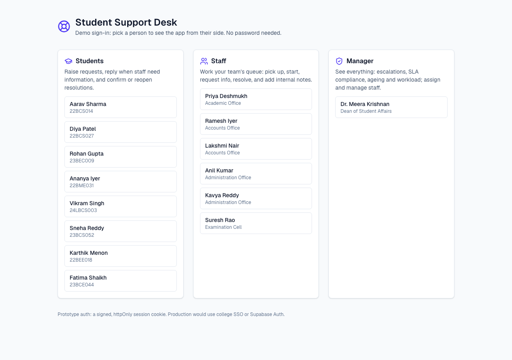
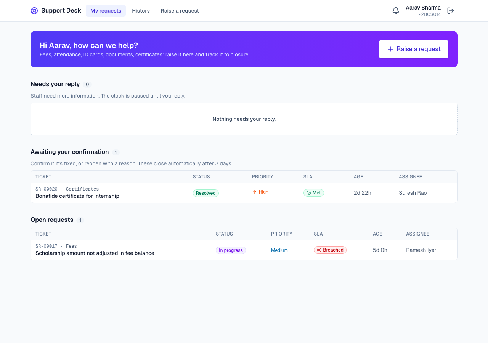
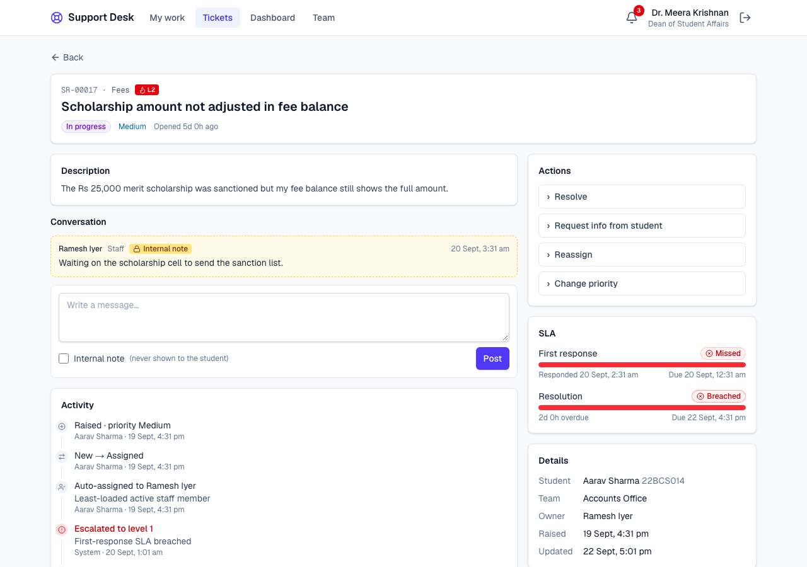
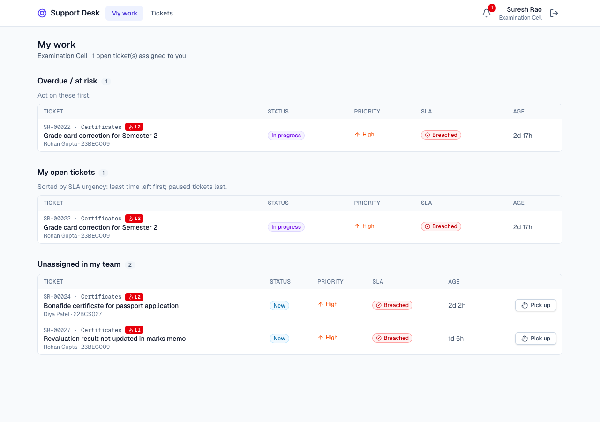
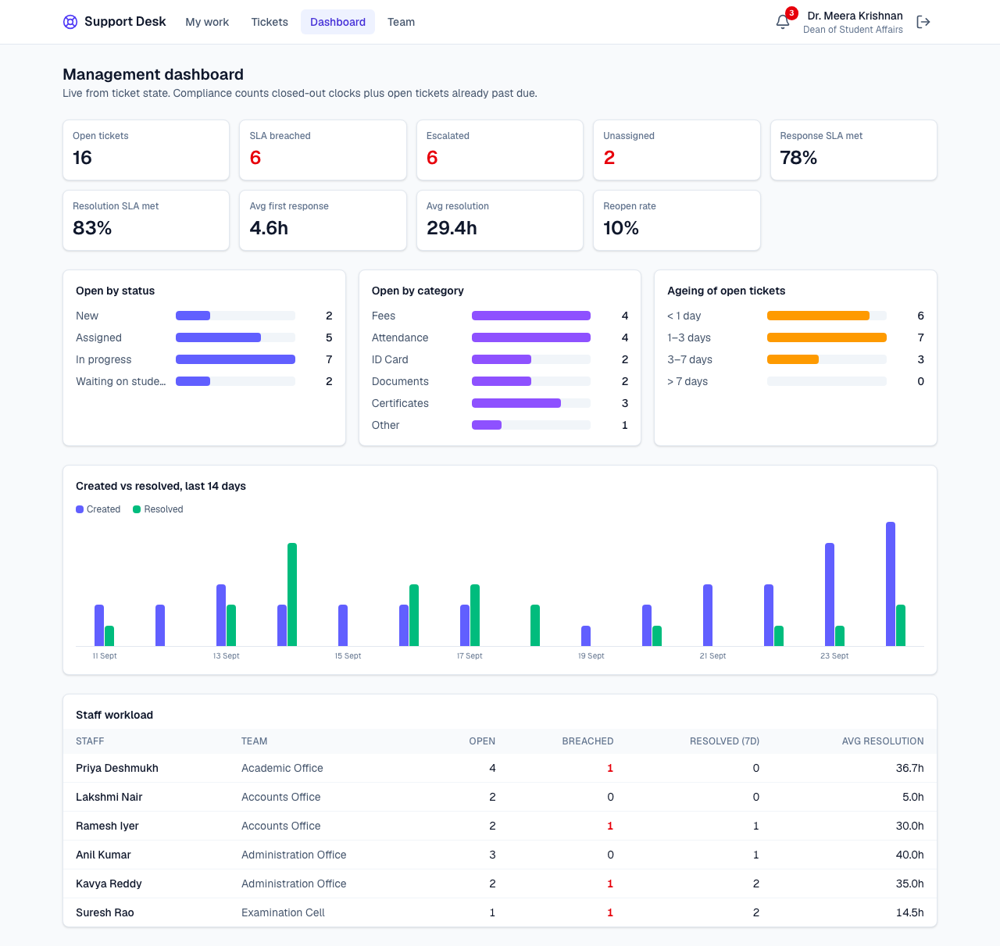

# Student Support Desk

A ticketing system for college administrative requests: fees, attendance, ID cards, documents, certificates and more. Students raise requests, the owning office picks them up and resolves them within an SLA, and the Dean sees ageing, breaches, escalations and workload in one place.

Built for **Edumerge Pre-Drive Assignment 4: Student Support & Ticket Management**.

- **Live demo:** https://edumerge-support-desk.vercel.app
- **Approach, assumptions and trade-offs:** [docs/APPROACH.md](docs/APPROACH.md)
- **AI usage report:** [docs/AI_USAGE_REPORT.md](docs/AI_USAGE_REPORT.md) (raw log: [docs/ai-log.md](docs/ai-log.md))

## Screenshots

| Demo login | Student: My requests |
|---|---|
|  |  |

| Ticket detail: SLA bars, internal note, timeline | Staff: queue with Pick up |
|---|---|
|  |  |

**Manager dashboard**



## Demo logins: "log in as X to see Y"

No passwords. The login page lists everyone, grouped by role.

> Demo data is anchored to the moment it was loaded, and the clocks keep running in real time; that's the point of an SLA system. The descriptions below match a fresh `npm run db:load`. A day later, some at-risk tickets will have breached and resolved ones will have auto-closed.

| Log in as | To see |
|---|---|
| **Aarav Sharma** (student) | "Awaiting your confirmation" (a resolved certificate request) and an open, escalated fees ticket. Raise a new Fees request to trigger the **duplicate warning**. |
| **Karthik Menon** (student) | "Needs your reply": staff asked for a UTR number more than 48 h ago, so the SLA is **paused** and a **reminder** was sent. |
| **Suresh Rao** (staff, Examination Cell) | The only person in his team. He was on leave, so two certificate requests sat **unassigned and breached** in his queue. Use **Pick up**. |
| **Ramesh Iyer** (staff, Accounts) | A ticket escalated to **L2** with an internal note, and a **reopened** refund ticket with a fresh SLA window. |
| **Dr. Meera Krishnan** (manager) | Attention list (unassigned, breached, escalated), the **dashboard** (compliance, ageing, workload, 14-day trend), and **Team**, where you can deactivate staff and watch their tickets re-home. |

## Two-minute demo script

1. **Student raises a request (30 s).** Log in as *Aarav Sharma* → **Raise a request** → category *Fees*. The hint shows the owning office and SLA. Submit: you get a *duplicate warning* linking to his open fees ticket → **create anyway**. The ticket is auto-assigned to the least-loaded Accounts staff member.
2. **Staff works it (40 s).** Switch user (top-right icon) → the assignee named on the ticket (e.g. *Ramesh Iyer*) → open it → **Start work** (first-response clock stops) → post an **internal note** → **Request info** (resolution clock pauses) or **Resolve** with a note.
3. **Student closes the loop (20 s).** Back as *Aarav*: the internal note isn't there. **Confirm**, or **Reopen** with a reason (a fresh resolution window starts and the ticket is auto-assigned again).
4. **Manager view (30 s).** *Dr. Meera Krishnan* → attention list → **Dashboard**. Then **Team** → deactivate *Suresh Rao*: his open tickets go back to the queue (there's nobody else in the Exam Cell) and you're notified. Reactivate him.

## Tech stack

- **Next.js 16** (App Router, Server Components, Server Actions, TypeScript), deployed on **Vercel** (functions pinned to `syd1`, next to the DB)
- **Supabase Postgres** via `postgres` (postgres.js): plain SQL, no ORM, all tables in a dedicated `support_desk` schema
- **Tailwind CSS 4** + `lucide-react`; charts are plain CSS bars
- **zod** for server-side input validation, **Vitest** for tests, **Playwright** for the end-to-end smoke test and screenshots

## Local setup

```bash
npm i
cp .env.example .env.local   # fill in DATABASE_URL, SESSION_SECRET (≥16 chars), CRON_SECRET
npm run db:load              # fast: schema + SQL snapshot of the seed (a few seconds)
npm run dev                  # http://localhost:3000
```

| Script | What it does |
|---|---|
| `npm run db:setup` | Idempotent schema, then **replays** ~2 weeks of activity through the real services with a mocked clock. Slow over a far-away pooler (~15 min at ~360 ms/query). |
| `npm run db:reset` | Drops **only** the `support_desk` schema, then `db:setup`. |
| `npm run db:load` | Drops `support_desk`, then loads `db/schema.sql` + `db/seed.sql` (timestamps are relative to `now()`, so SLA states stay realistic). |
| `npm run db:export-sql` | Regenerates `db/seed.sql` from whatever the replay produced. |

You can also paste `db/schema.sql` and then `db/seed.sql` into the Supabase SQL editor.

> If the project lives in a cloud-synced folder (OneDrive/iCloud), `next dev` (Turbopack) can hang on file watching. Use `npm run build && npm start`, or clone somewhere unsynced.

## Tests

```bash
npm test                                                        # 67 Vitest cases (pure domain logic)
BASE_URL=http://localhost:3000 npx tsx scripts/e2e-smoke.ts      # 15 end-to-end checks against a running app
```

The unit tests cover every allowed transition and a set of illegal ones; permissions (students can't see others' tickets or post internal notes; staff can't pick up another team's ticket or act on one they don't own; managers can); SLA states, pause maths, priority recalculation and met/missed; the "needed by" priority rule; auto-assign; sweep escalation L1/L2, reminders, auto-close and idempotency; reopen; and optimistic locking. The e2e script creates a real ticket, works it as staff, checks the student can't see the internal note, and checks that a stale second tab is rejected.

## Project structure

```
db/                 schema.sql (idempotent) · seed.ts + scenarios.ts (replayed seed) · seed.sql (snapshot) · setup.ts · export-sql.ts
src/lib/domain/     pure rules, no I/O: types, config, transitions, permissions, sla, priority, assign,
                    workflow (every action as a pure function), sweep, draft (outcome builder), errors
src/lib/services/   DB side: tickets (actions, one transaction each), staff, sweep, queries (row-level visibility), reports, repo
src/lib/            db.ts (single postgres.js client) · clock.ts (injectable now) · session.ts (signed cookie) · format.ts
src/app/            login · (app)/ My work, tickets, tickets/new, tickets/[id], dashboard, team, notifications · api/cron/sla-sweep
src/components/     badges, ticket list, SLA panel, timeline, action panel/forms, charts, nav
tests/              Vitest domain tests
scripts/            e2e-smoke.ts (Playwright)
docs/               APPROACH.md, AI_USAGE_REPORT.md, ai-log.md, screenshots/, ops/ (optional 15-min sweep workflow)
```
