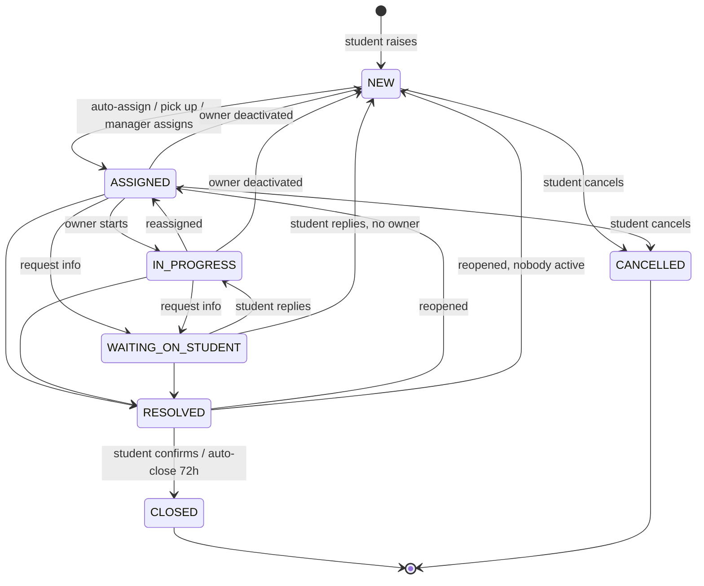
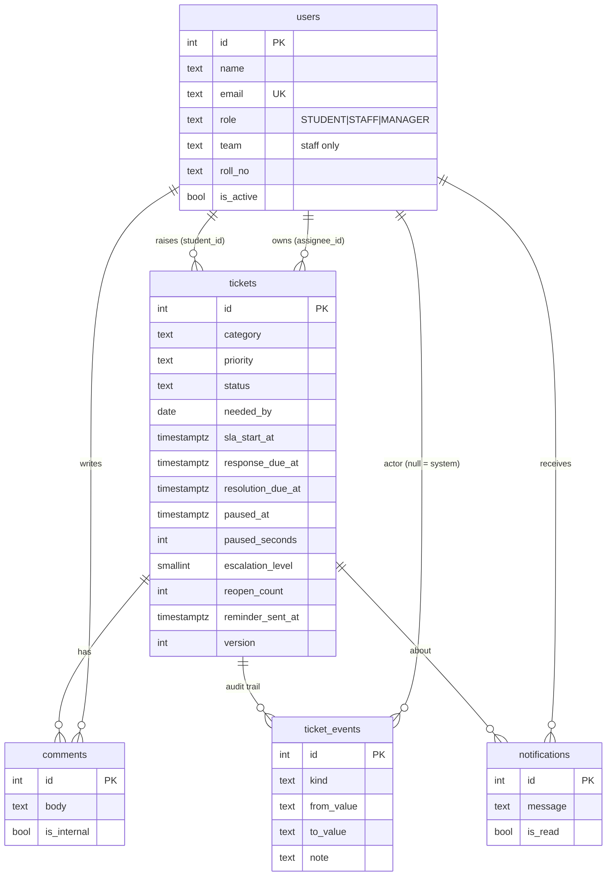

# Approach

## 1. Problem understanding

Administrative requests in a college usually arrive over WhatsApp, email and at the counter. Nobody clearly owns them, nobody can say how long they've been waiting, and the Dean only hears about a problem when a parent complains. The assignment asks for more than a form and a list. It asks for **accountability over time**: every request has exactly one owner, an explicit status, a deadline that matches its urgency, an audit trail, and an escalation path when the deadline slips.

I treated it as three connected problems:

1. **Routing and ownership:** get each request to the right office and a named person automatically, and never leave it orphaned (leave, exits, reopenings).
2. **Time:** make "how late is this?" a computed fact (two SLA clocks, ageing, pause when the ball is in the student's court) rather than a feeling.
3. **Visibility and pending actions:** every role opens the app and immediately sees *their* next action; the manager sees risk before it becomes a complaint.

## 2. Users and their pain points

| User | Pain today | What the app gives them |
|---|---|---|
| **Student** | Doesn't know who has the request, whether anyone saw it, or when it'll be done; has to chase in person. | One place to raise and track requests; clear "Needs your reply" and "Awaiting your confirmation" sections; notifications; reopen if not fixed. |
| **Staff** (one office) | Requests scattered across channels; no priority order; repeated "any update?" questions. | A queue sorted by SLA urgency; pick-up from the team queue; request-info that pauses the clock; internal notes. |
| **Manager** (Dean of Student Affairs) | No view of backlog, ageing or who's overloaded; learns about breaches too late. | Attention list (unassigned, breached, escalated), dashboard (compliance, ageing, workload, trend), reassignment, staff deactivation with automatic re-homing. |

## 3. Assumptions

1. One college, one campus, timezone **Asia/Kolkata**; all times are stored in UTC (`timestamptz`) and shown in IST.
2. Each category is owned by exactly one team: Fees → Accounts; Attendance → Academic Office; ID Card, Documents, Other → Administration Office; Certificates → Examination Cell.
3. Each staff member belongs to exactly one team. The manager belongs to none and can act on everything.
4. **Students don't choose priority**; it comes from the category. A genuine deadline ("needed by" within 2 campus days) raises it to at least High. Staff and managers can change it, with a mandatory reason.
5. SLAs use **calendar hours**, not business hours (see trade-offs).
6. First response = the first *visible* staff action (public comment, start, request info, resolve). Assignment alone isn't a response, since the student can't see it.
7. The resolution clock pauses only while *Waiting on student*. A reopen starts a fresh resolution window; the first-response clock doesn't restart.
8. Students can cancel only before work starts (NEW or ASSIGNED). After that, the request is resolved or closed, never silently withdrawn.
9. Closed and Cancelled are terminal; a recurring problem is a new ticket (keeps metrics honest).
10. Resolved tickets auto-close after **72 h** of silence; students waiting on an info request get **one** reminder after 48 h per waiting period.
11. Auto-assign uses least current open load within the owning team (tie → lowest id). Skills, shifts and working hours are out of scope.
12. "6 staff across 4 teams" can't have exactly one single-person team (1+2+2+2 = 7), so the seed has two single-person teams (Academic Office, Examination Cell). The Exam Cell is used to demo "nobody active in the team".
13. Priority-change reasons and resolution notes are visible to the student (transparency). Internal notes, escalations and "left in queue" events are staff-only.
14. Demo login (click a user) stands in for real authentication; every server action still re-checks identity and permissions from the database.

## 4. Status model



The table lives in one place (`src/lib/domain/transitions.ts`), and every action goes through `assertTransition()`. The DB adds a second guard: a `CHECK` constraint that `paused_at` is set **if and only if** the status is `WAITING_ON_STUDENT`.

## 5. SLA and escalation design

| Priority | First response | Resolution |
|---|---|---|
| Urgent | 2 h | 24 h |
| High | 4 h | 48 h |
| Medium | 8 h | 72 h |
| Low | 24 h | 120 h |

- **Two clocks, because they answer different questions.** "Has anyone looked at it?" (response) versus "Is it done?" (resolution). A student who gets an acknowledgement in an hour is far calmer than one who waits two days in silence, even when the fix takes the same time.
- **Pause, don't reset.** When staff need something from the student, the resolution clock pauses. On resume, the paused duration is added to `paused_seconds` and to the due date, so the maths is exact and auditable. The first-response clock never pauses, because the first contact already happened.
- **States per clock:** `on_track`, `at_risk` (< 25 % of the window left), `breached`, `paused`, `met`, `missed`. List views show the *worst live* state; on an open ticket a missed first response is history, so the chip follows the resolution clock.
- **Priority changes** recalculate both due dates from their original starts (created / `sla_start_at`) plus paused time. Raising priority can make a ticket instantly at risk, which is correct.
- **Escalation ladder:**
  - **L1:** first response breached → managers + assignee notified.
  - **L2:** resolution breached → managers + assignee notified.
  - Each level is set once. A reopen resets the level, because it's a new resolution window.
- **Pending actions for the student:** after 48 h waiting → one reminder per waiting period (guarded by `reminder_sent_at < paused_at`). Resolved for 72 h with no response → system auto-closes.
- **Idempotent sweep:** every rule is guarded by a field the rule itself sets, so running it twice changes nothing (tested). Escalation and reminder flags don't bump the ticket `version`, so a sweep never makes a staff member's open form stale; auto-close does bump it, because the status changed.

## 6. Data model



All tables live in a dedicated `support_desk` schema (the database is shared with another app's `public` tables, which are never touched). There are `CHECK` constraints on role, team, status, priority, category and length limits, plus indexes on status, assignee, student and category. Codes like `SR-00012` are derived from the id. Beyond the spec I added `reminder_sent_at` (needed for "one reminder per waiting period") and made `notifications.ticket_id` nullable (for staff-deactivation summaries).

## 7. Architecture

```
Browser ── Server Components (reads) ─┐
       └── Server Actions (zod) ──────┤→ services (1 transaction each) → postgres.js → Supabase
Vercel Cron / page load → runSlaSweep ┘        │
                                              ▼
                                pure domain (no I/O, fully unit-tested)
```

- **Pure domain layer.** Every action (`createTicket`, `start`, `requestInfo`, `resolve`, `reopen`, `releaseFromStaff`, `sweepTicket`, …) is a pure function: `(ticket, input, ctx{actor, now, staff loads, managers}) → {ticket', events[], comments[], notifications[]}`. The 67 tests target these directly, with no DB mocks.
- **Services are thin.** Each one opens a transaction, locks the row (`SELECT … FOR UPDATE`), loads the actor fresh from the DB, runs the pure function on the fresh row, then writes the ticket, audit events, comments and notifications together. The `UPDATE … WHERE version = $expected` is a second line of defence.
- **Optimistic locking.** Every form posts the `version` it was rendered with. A mismatch returns "This ticket was updated by someone else, reload" and changes nothing.
- **Row-level visibility in SQL.** Student queries are always filtered `student_id = me`, and internal comments and staff-only events are excluded in the query, not in the UI.
- **Seed through the real services.** `db/seed.ts` replays 14 days of scenarios in time order with a mocked clock, including a simulated sweep every 2 h and the Exam Cell staff member's leave, so every event and SLA field is exactly what the live app would produce. `db/seed.sql` is a snapshot of that result with timestamps rewritten as `now() - interval`.

## 8. Trade-offs

| Decision | Why | Cost / what I'd do at scale |
|---|---|---|
| **Calendar hours**, not business hours | Simple, predictable, easy to explain to students; the prototype stays honest. | Weekends and holidays count. Next step: a campus calendar table and a business-hours `addWorkingHours()` in `sla.ts` (the only place due dates are computed). |
| **Sweep on read + cron**, not a queue/worker | Vercel has no background workers. The sweep is idempotent and cheap (one indexed candidate query), so running it on My work and dashboard loads keeps state fresh whenever anyone is looking. | Vercel Hobby only allows **daily** crons, so `vercel.json` runs once a day as a safety net and `docs/ops/sla-sweep.github-workflow.yml` gives a free 15-minute schedule. At scale: a proper job queue with notification fan-out. |
| **Demo login** | The assignment is about workflow, not identity; reviewers can switch roles in one click. | Signed httpOnly cookie, and every action re-loads the user from the DB. Production: college SSO / Supabase Auth, with roles from the student information system. |
| **In-memory filtering** for the list | Exact SLA-state filters and sorts (computed, not stored), for one college's data (hundreds of open tickets). | Beyond a few thousand rows: store the next-due timestamp, and filter and page in SQL. |
| **No attachments, no email/SMS** | Time box; in-app notifications show the flow. | Supabase Storage for files; email/WhatsApp notifications from the same notification rows. |
| **Least-open-tickets auto-assign** | Fair, explainable, no configuration. | Doesn't account for effort or skills. Could weight by priority or add shift calendars. |
| **postgres.js, no ORM** | Plain, readable SQL, one small data layer, works with the Supabase pooler (`prepare: false`). | More hand-written mapping (handled by `postgres.camel`). |

## 9. Edge cases handled, and how they're validated

| Edge case | Handling | Validated by |
|---|---|---|
| Illegal status jump (CLOSED → IN_PROGRESS, NEW → RESOLVED, anything out of CANCELLED) | `assertTransition` throws; friendly message in the UI | unit tests (every allowed pair + illegal ones) |
| Student opens another student's ticket by id | SQL filter + `requireView`; forbidden and missing both render "Not found", so ids can't be probed | unit test + e2e (checks no data leaks into HTML) |
| Student tries to post an internal note (crafted POST) | Server re-checks `canComment(internal)` | unit test |
| Staff acts on a teammate's ticket or picks up another team's | `canWork` / `canPickUp` on the server | unit tests |
| Two people edit the same ticket | `version` check + row lock → "updated by someone else, reload" | unit test + e2e (two tabs) |
| User acts again before their own last action's refresh lands | Same stale-version guard; safe, the user just reloads | found during e2e (ai-log #10) |
| Nobody active in the owning team | Ticket stays NEW in the queue; managers notified | unit test; seed (Exam Cell leave) |
| Staff deactivated with open work | ASSIGNED/IN_PROGRESS → NEW, WAITING keeps status, each re-homed in-team, managers get a summary | unit tests; manual on /team |
| Student replies after owner left | WAITING → NEW (not IN_PROGRESS), managers notified | unit test |
| Everyone marks their request Urgent | Students can't set priority; only a "needed by" ≤ 2 days bumps to High | unit tests |
| Needed-by date in the past or absurdly far | zod + range check (today … +1 year) | server action |
| Duplicate request in the same category | Warning with link + explicit "create anyway" | e2e |
| Sweep runs twice / concurrently with a user action | Guards on its own fields + per-ticket row lock; no version bump for flags | unit tests (idempotency) |
| Resolve while waiting on student | Clock resumed first, so paused time is counted correctly | unit test |
| Deactivated staff member logs in | Can view, can't act (banner shown) | unit test (`canWork` false) |
| DB unreachable | Friendly error page with retry; login page shows a message | manual |

## 10. What I'd build next

1. Real auth (college SSO / Supabase Auth) and roles synced from the student information system.
2. Business-hours SLAs with a holiday calendar; per-category SLA overrides editable by the manager.
3. Email/WhatsApp notifications, and a daily digest for managers.
4. Attachments (fee receipts, medical certificates) with virus scanning.
5. Canned responses and a knowledge base that deflects common questions ("how to get a bonafide certificate").
6. CSAT on close, and SLA/compliance export for accreditation reports (NAAC).
7. A proper scheduler (Vercel Pro cron or a queue) and SQL-side pagination for large volumes.
